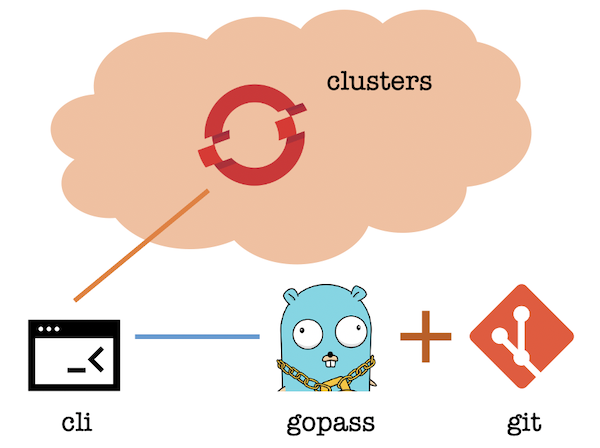

## Enhanced OpenShift CLI

The enhanced OpenShift CLI (or oc) is not a replacement of the original OpenShift CLI. It is essentially a shell on top of the original oc. By using enhanced oc, you can manage very large amount of clusters both in a secure and efficient manner with better team collaboration.

### Advantages:

* **Security**: Cluster access data including password are all encrypted and saved in a secret store to avoid sensitive information disclosure.
* **Efficiency**: Login to a cluster can be done by using a human-memorable alias without specifying the full cluster access information.
* **Team collaborion**: The same set of cluster access information can be shared with and reused by your team members in a secure way.

### Features

The enhanced oc supports all the original oc commands and their options, plus some additional cool features:

* Login a cluster with full context information provided only once, then use an alias to re-login at any time.
* Organize many clusters hierarchically, switch among them efficiently by partial input, fuzzy search, nice shell prompt.
* Share cluster context information with your team members for large scale project and team collaboration.

