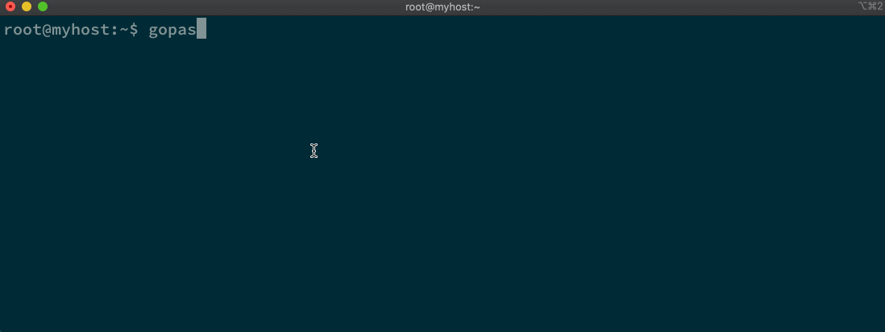
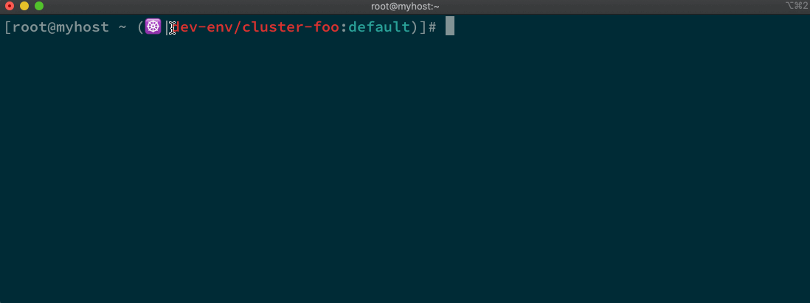

## Advanced Use

### Organize Your Cluster Contexts Hierarchically

In a real project, it is common that you have many clusters to manage and each cluster has its own access data. It is a good idea to use the enhanced oc and context alias to switch among these clusters efficiently. However, with more and more clusters added, the context list can be increasingly long. In such case, a more efficient way to manage these clusters is to organize the contexts hierarchically.

This is natively supported by gopass because in gopass store, each secret data lives in its own file and related secret data can be put in the same directory. So, for example, if you have 3 clusters and want to store the contexts for them all, you can use the `path/to/your/context` format to name the context alias for the clusters.

```shell
$ oc login -s https://api.foo.example.com -c dev-env/cluster-foo
$ oc login -s https://api.bar.example.com -c dev-env/cluster-foo
$ oc login -s https://api.baz.example.com -c dev-env/cluster-foo
```

Then your cluster contexts will be organized hierachically in the gopass store and the directory structure maps to how you name the context alias. This can be seen with a very straightforward view by running `gopass ls`:
```shell
$ gopass ls
gopass
└── dev-env
    ├── cluster-foo
    ├── cluster-bar
    └── cluster-baz
```

When you switch among these clusters, you can use the `path/to/your/context` value to refer to the target cluster that you want to access:
```shell
$ oc login -c dev-env/cluster-foo
$ oc login -c dev-env/cluster-foo
$ oc login -c dev-env/cluster-foo
```

### Choose Among Multiple Clusters

To organize cluster contexts hierarchically allows you to manage large amount of clusters, category them into different groups for different purposes, and switch among them efficiently. With more clusters added and the hierarchy expending, you may also find it is not very trivial to input the full context alias of each cluster when you login to it.

The enhanced oc supports partial input for context alias when you run `oc login`. For example, if you put all clusters for development in `dev-env` category, you can just input the first a few characters such as `de`, `dev`, `dev-`, `dev-env` when you specify the context alias. If there are multiple results that match your input, a numbered list will be presented. You can enter a number to chose one option in the list:
```shell
$ oc login -c dev
1) dev-env/cluster-bar
2) dev-env/cluster-baz
3) dev-env/cluster-foo
#? 1
Read context 'dev-env/cluster-bar' from secret store...
Context loaded successfully.
Login successful.

You have access to 59 projects, the list has been suppressed. You can list all projects with 'oc projects'

Using project "default".
```

### Fuzzy search

The partial input of context alias and the numbered list can help you quickly choose the cluster among multiple options. However, if you installed [fzf](https://github.com/junegunn/fzf), an interactive command-line filter and fuzzy finder, you should be able to use typeahead and fuzzy search to select a context. For how to install fzf, please check the [fzf documentation](https://github.com/junegunn/fzf#installation).



### Customize the Shell Prompt

For better use experience, you can install [kube-ps1](https://github.com/jonmosco/kube-ps1), which is a script that lets you add the current cluster context and namespace to the shell prompt. It is very helpful when you have many clusters to manage and need to switch among them from time to time. By looking at the shell prompt from the command line, you can know the cluster context that you are working with very quickly, so as to avoid operation performed against the wrong cluster.

The enhanced oc can integrate with kube-ps1 seamlessly when you have kube-ps1 installed. It will customize the shell prompt, replace the full cluster context name, which is usually longer and more machine friendly, with the context alias, which is shorter and more user friendly. For how to install kube-ps1, please check the [kube-ps1 documentation](https://github.com/jonmosco/kube-ps1#installing).


