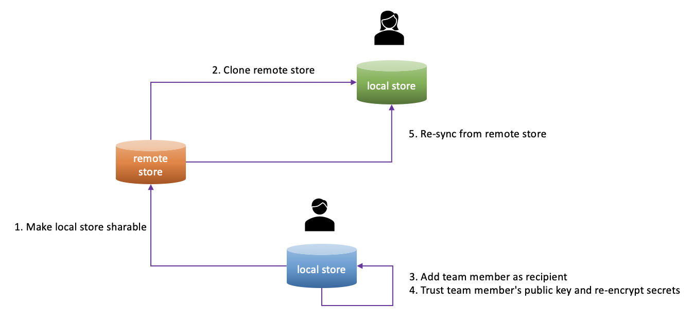

## Sharing in Team

Using enhanced oc and gopass can help you manage your cluster contexts securely and efficiently. But this only applies to your local work. If you want your team members to get these benefits as well, you can share your cluster contexts with them. It can be done by using gopass, because gopass is natively support secrets sharing among teams.



### Step 1: 👨 Make local store sharable

If you have not created a local secret store yet, you can initialize a new one and push it to an empty remote git repository. For example:
```shell
$ gopass --yes setup --remote git@github.example.com:william/team-clusters.git --alias team-clusters --create --name "William" --email "william@example.com"
```

This will create a new secret store as a local git repository, connect it to the git remote (`--remote` option), configure the git user name and email (`--name` and `--email` option), give the store a local mount point (`--alias` option), in this case `team-clusters`. gopass supports multi-store that can be mounted over each other like file systems on Linux/UNIX systems. This allows you to work on multiple stores at the same time. For example, you can have both a local store to save your private data and a sharable store for team collaboration.

**NOTE:**

> Althouth you can use HTTPS when connect to the remote git server such as GitHub, it is recommanded to use SSH. With SSH keys, you can connect to GitHub without supplying your username and personal access token at each visit. For how to connect to GitHub with SSH, please refer to the [GitHub documentation](https://docs.github.com/en/github/authenticating-to-github/connecting-to-github-with-ssh).

If you already have a local store and want to share with your team members. You can do:
```shell
$ gopass git remote add origin git@github.example.com:william/team-clusters.git
```

To verify the git remote setting. Go into the store directory and print the setting. Depend on whether or not you specify `--path` option when create the store, by default it is a sub-directory in `~/.local/share/gopass/stores`.
```shell
$ git remote -v
origin	git@github.example.com:william/team-clusters.git (fetch)
origin	git@github.exmaple.com:william/team-clusters.git (push)
```

Now you can push your local store to the remote git repository:
```shell
$ git push -u origin master
```

### Step 2: 👩 Clone a remote store

Now that you have a sharable remote store, every other team member can initialize a local store by cloning this remote store. Before that, please make sure you have granted sufficient permission for your team members to access the remote store. For example, if you use GitHub, this may require you to add your team member as collaborator into the git repository. After that, your team member can do:
```shell
$ gopass --yes setup --remote git@github.example.com:william/team-clusters.git --alias team-clusters --name Nicole --email "nicole@example.com"
```

It will clone the remote store to your team member's machine as a local git repository with all necessary settings configured, including the git remote setting, git user name and email, as well as the local mount point. If you see similar message as below after the clone is finished:
```
[init] [team-clusters]Joined Team 'team-clusters'
[init] [team-clusters]Note: You still need to request access to decrypt any secret!
```

This means your team member has successfully created a local store that is cloned from the remote one. By listing all the secrets saved in the store at the moment, your team member should be able to see exactly the same secret structure as you do in your local store:
```shell
$ gopass ls team-clusters
team-clusters/
└── dev-env/
    ├── cluster-bar
    ├── cluster-baz
    └── cluster-foo
```

You may also notice the above message `You still need to request access to decrypt any secret!`. It is because your team member still does not have the right secret key to decrypt the secrets although they can be listed. It will be failed if your team member tries to view the secret:
```shell
$ gopass show team-clusters/dev-env/cluster-foo
gpg: decryption failed: No secret key
Decryption failed: exit status 2
Error: failed to retrieve secret 'team-clusters/dev-env/cluster-foo': Failed to decrypt
```

We will fix this issue later in this document.

If your team member already has an existing store at local and wants to reuse it, just clone the remote store as a sub-mount underneath:
```shell
$ gopass clone git@github.example.com:william/team-clusters.git team-clusters
```

It may ask for the user name and email as git config for the store. Just input your team member's user name and email. After the sub-store is created, again your team member can run `gopass ls` to list the secrets and verify the result.

### Step 3: 👩 Add team member as recipient

After team members clone the store, in order to decrypt the secrets in the store, they need to add themselves to the recipients of that store and sync this change back to the remote. Before that, to view the current recipients of the store on your team member's machine:
```shell
$ gopass recipients
Hint: run 'gopass sync' to import any missing public keys
gopass
├── 0xFB8C81C172C9C86E - Nicole <nicole@example.com>
└── team-clusters (/root/.local/share/gopass/stores/team-clusters)
    └── 0xABCA15DBF8D7E33F (missing public key)
```

In this case, there is one root store and one sub-store where the sub-store `team-clusters` maps to the remote store that you just shared. For now, it does not include your team member's public key `0xFB8C81C172C9C86E`. Also, there is an error `missing public key` alongside the public key `0xABCA15DBF8D7E33F` which is the original key in the remote store mapping to yourself. To add your team member to the recipients, run on your team member's machine:
```shell
$ gopass recipients add
```

Make sure you choose the right store `team-clusters` and public key `0xFB8C81C172C9C86E`. If you see below message:
```shell
Added 1 recipients
```

This means you have added the recipient successfully. To verify it by revisiting the recipients:
```shell
$ gopass recipients
Hint: run 'gopass sync' to import any missing public keys
gopass
├── 0xFB8C81C172C9C86E - Nicole <nicole@example.com>
└── team-clusters (/root/.local/share/gopass/stores/team-clusters)
    ├── 0xABCA15DBF8D7E33F (missing public key)
    └── 0xFB8C81C172C9C86E - Nicole <nicole@example.com>
```

Now you can see your team member's public key has been added into the sub-store. Let's sync this change back to the remote store:
```shell
$ gopass sync
```

Gopass offers as simple and intuitive way to sync one or many stores with their remotes. This will perform git pull and git push to import or export any missing public keys. List the recipients again after the sync is finished and you will see the `missing public key` error has gone:
```shell
$ gopass recipients
Hint: run 'gopass sync' to import any missing public keys
gopass
├── 0xFB8C81C172C9C86E - Nicole <nicole@example.com>
└── team-clusters (/root/.local/share/gopass/stores/team-clusters)
    ├── 0xABCA15DBF8D7E33F - William <William@example.com>
    └── 0xFB8C81C172C9C86E - Nicole <nicole@example.com>
```

### Step 4: 👨 Trust team member's public key and re-encrypt secrets

Still, this is not enough yet as you need to trust the newly added public key and re-encrypt all secrets for it. This needs to be done on your machine. Before that, list the recipients on your machine to make sure only yourself is in the list:
```shell
$ gopass recipients
Hint: run 'gopass sync' to import any missing public keys
gopass
└── 0xABCA15DBF8D7E33F - William <William@example.com>
```

Now sync change made by your team member as above from the remote store:
```shell
$ gopass sync
```

Revisit the recipients and verify if your team member has been added to the recipients:
```shell
$ gopass recipients
Hint: run 'gopass sync' to import any missing public keys
gopass
├── 0xABCA15DBF8D7E33F - William <william@example.com>
└── 0xFB8C81C172C9C86E - Nicole <nicole@example.com>
```

Then copy the new member's public key ID `0xFB8C81C172C9C86E`, sign this public key using your own secret key, then trust it. This can be done by running `gpg` on your machine:
```shell
$ gpg --edit-key 0xFB8C81C172C9C86E
gpg> lsign
gpg> trust
gpg> save
```

When trust the key, you will be prompted with a list:
```
  1 = I don't know or won't say
  2 = I do NOT trust
  3 = I trust marginally
  4 = I trust fully
  5 = I trust ultimately
  m = back to the main menu
```

Choose 5 as your decision.

Now re-add the recipient that maps to your team member on your machine to trigger the secrets re-encryption in your local store, followed by a sync to push changes back to the remote store:
```shell
$ gopass recipients rm nicole@example.com --store team-clusters
$ gopass recipients add nicole@example.com --store team-clusters
$ gopass sync
```

### Step 5: 👩 Re-sync from remote store

Since the secrets have been re-encrypted by you, your team members need to do another sync to retrieve the changes from remote store:
```shell
$ gopass sync
```

After that, they will be able to fully use the store. For example, to decrypt the secret, there will be no error anymore:
```shell
$ gopass show team-clusters/dev-env/cluster-bar
```

### References

* https://hceris.com/storing-passwords-with-gopass/
* https://blog.codecentric.de/en/2019/02/manage-team-passwords-gopass/
